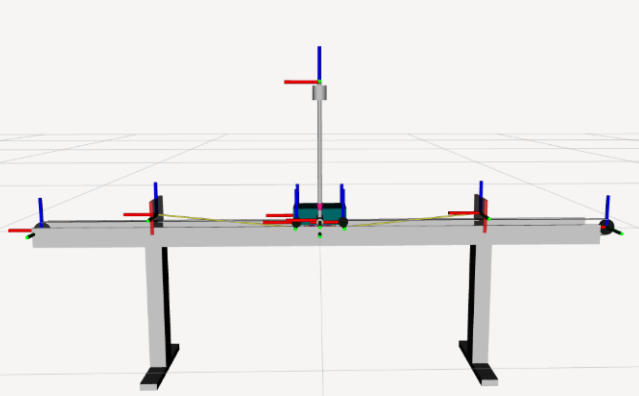

# Control No Lineal y Estabilización en Tiempo Real de un Sistema Subactuado utilizando Arquitectura C2000

[](https://www.mathworks.com/products/matlab.html)
[](https://docs.ros.org/en/humble/index.html)
[](https://www.ti.com/product/es-mx/TMS320F280049C)
[](./)

Este repositorio contiene el ecosistema completo de software, firmware y herramientas de análisis desarrolladas para mi Trabajo de Final de Grado (TFG) en el **Grado en Inteligencia Robótica** de la **Universitat Jaume I (UJI)**.

El proyecto aborda de forma integral el modelado matemático, la identificación paramétrica experimental, la simulación híbrida, el control en tiempo real estricto y la telemetría 3D de un **sistema subactuado de péndulo invertido sobre carro (Cart-Pole)** utilizando la plataforma de control en tiempo real **TI C2000**.

<p align="center">
  
  <br>
  <em>Gometría y diseño conceptual del sistema.</em>
</p>

---

## Características Clave del Sistema

### Firmware
Implementación nativa en **C** sobre el microcontrolador de control en tiempo real `TMS320F280049C`. Configuración a bajo nivel de periféricos críticos para garantizar determinismo estricto:
* `ePWM`: Modulación por ancho de pulsos para el control dinámico del motor de continua.
* `eQEP`: Decodificación por hardware de encoders en cuadratura para la lectura posicional.
* `SCI`: Interfaz de comunicación serie asíncrona dedicada a la transmisión de telemetría de alta velocidad.

### Estrategias de Control Avanzado
* **Algoritmo de Swing-Up:** Ley de control no lineal basada en funciones de energía y linealización parcial por realimentación (*Partial Feedback Linearization - PFL*) para elevar el péndulo desde su posición de reposo.
* **Control de Estabilización:** Regulación robusta mediante realimentación del estado ($Kx$) diseñada a través de un regulador óptimo lineal cuadrático (**LQR**), incluyendo extensiones con acción integral para el rechazo de perturbaciones estáticas en el carro.
* **Control Híbrido Conmutado:** Autómata de control que gestiona la transición suave, determinista y segura en tiempo real entre el lazo de balanceo y el lazo de estabilización dentro de la región de atracción del punto de equilibrio inestable.

### Gemelo Digital (ROS 2 Humble)
Desacoplamiento de la capa de control crítico de la capa de visualización 3D en `RViz` mediante un modelo geométrico `URDF`, operando bajo una arquitectura dual:
* **Modo Simulación:** Co-simulación directa con **MATLAB/Simulink** a través de *ROS Toolbox* para la validación previa de los algoritmos en entornos virtuales.
* **Modo Sistema Real:** Monitorización del prototipo físico mediante el nodo `serial_node.py` en Python, encargado de monitorizar eficientemente de las tramas provenientes del periférico `SCI`.

---

## Caracterización e Identificación Experimental

Con el objetivo de obtener las constantes físicas precisas para el modelo dinámico formal, se diseñó e implementó la siguiente metodología de ensayos:

| Módulo del Sistema | Método Experimental | Variable Identificada | Propósito en el Modelo |
| :--- | :--- | :--- | :--- |
| **Actuador y Puente en H** | Análisis estático variando frecuencias de ciclo de trabajo en el rango de `200 Hz` a `10 kHz`. | **Zona Muerta ($V_{dead}$)** | Determinar el umbral mínimo de tensión necesario para vencer la fricción estática del motor. |
| **Planta Motriz** | Ensayos dinámicos en bucle cerrado mediante controladores de velocidad de tipo P y PI. | **Relación Par-Voltaje ($K_t$)** | Caracterizar la ganancia electromecánica del motor y modelar la conversión par-tensión. |
| **Dinámica del Carro** | Excitación controlada en bucle cerrado aplicando una ley de control proporcional de posición. | **Masa efectiva ($M$) y Fricción ($B_c$)** | Estimar la inercia lineal del carro y modelar sus coeficientes de rozamiento hardware. |
| **Eje del Péndulo** | Ensayos de oscilación libre desde condiciones iniciales no nulas procesados en MATLAB. | **Amortiguamiento ($B_p$)** | Aislar el coeficiente de fricción viscosa del eje rotatorio mediante **decremento logarítmico**. |

--- 
## Estructura del Repositorio

El proyecto está organizado de manera modular para separar las fases de análisis, simulación, despliegue y documentación:
```diff
TFG_Control_MiguelPorcar/
+ 📊 analisis_ensayos/                  # Scripts de procesamiento de datos experimentales reales
│   ├── controladores_Kx_cartpole/     # Comparativas de transitorios con matrices Q y R
│   ├── control_Kx_integrador_cartpole # Ensayos del controlador con acción integral
│   ├── conversion_par_voltaje/        # Caracterización del motor y puente en H
│   ├── ident_BC_carro/                # Identificación de la dinámica y masa del carro
│   ├── rozamiento_pendulo/            # Ensayos de oscilación libre y amortiguamiento
│   └── zona_muerta_frec_PWM/          # Comportamiento del motor según la frecuencia de PWM
│
+ 🦾 firmware_C2000/                    # Código fuente embebido (Code Composer Studio)
│   ├── experimentos/                  # Módulos lógicos y archivos de control .c individuales
│   └── f280049c_ws/                   # Workspace de CCS con drivers HAL y periféricos
│
+ 💻 simulacion/                        # Entornos virtuales previos al despliegue físico
│   ├── simulaciones_codigo/           # Algoritmos de control híbrido, swing-up y LQR (.m)
│   └── simulink/                      # Modelos de bloques .slx y pasarela ROS
│
+ 🤖 ros2_ws/                           # Workspace de ROS 2 Humble (Nodos de visualización)
│   └── src/cartpole_digital_twin/
│       ├── launch/                    # Lanzadores duales (sistema real y simulación)
│       ├── rviz/                      # Configuraciones gráficas de RViz
│       ├── urdf/                      # Modelo geométrico y físico del robot
│       └── cartpole_digital_twin/     # Nodos e hilos en Python de lectura serie
│
+ 📂 docs/                              # Memoria técnica del TFG, planos y vídeos demostrativos
